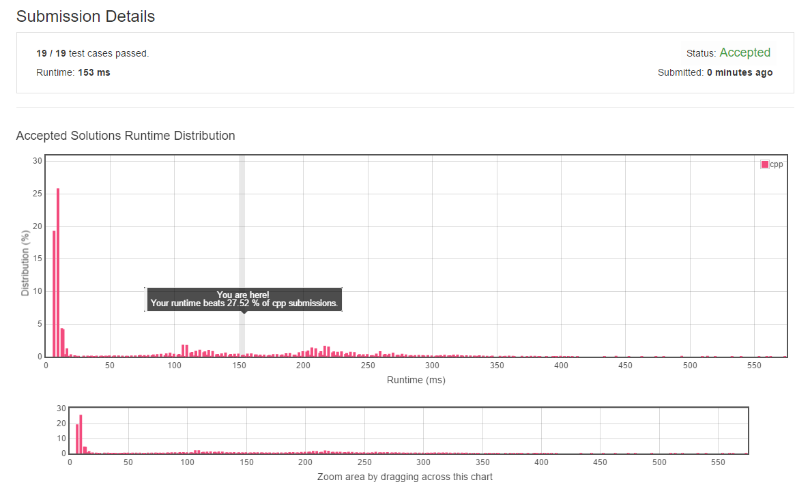

# 001. Two Sum
------------------------------------------------

## Description： 

- Given an array of integers, return indices of the two numbers such that they add up to a specific target.
You may assume that each input would have exactly one solution, and you may not use the same element twice.

## Example:
```
Given nums = [2, 7, 11, 15], target = 9,

Because nums[0] + nums[1] = 2 + 7 = 9,
return [0, 1].
```

## 解题思路：

对`vector`进行枚举就可以达到结果了，因为假设只存在唯一解，所以找到结果跳出就可以了。

### Result:

code： [Point here](main.cpp)
