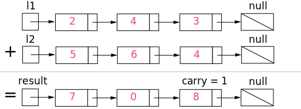

# 002. Add Two Numbers
------------------------------------------------

code： [Point here](main.cpp)

## Description:
You are given two non-empty linked lists representing two non-negative integers. The digits are stored in reverse order and each of their nodes contain a single digit. Add the two numbers and return it as a linked list.

You may assume the two numbers do not contain any leading zero, except the number 0 itself.

**Input:** (2 -> 4 -> 3) + (5 -> 6 -> 4)
**Output:** 7 -> 0 -> 8

## 解题思路
这题主要考了如何去使用链表结构，难度不大，类似于两个数的求和。这里踩了个坑（在成员函数里返回的是一个指针，则指针的空间需要使用`new`进行分配，如果使用函数里的变量地址会出错，因为成员函数内部变量在离开作用域时会被销毁掉。）