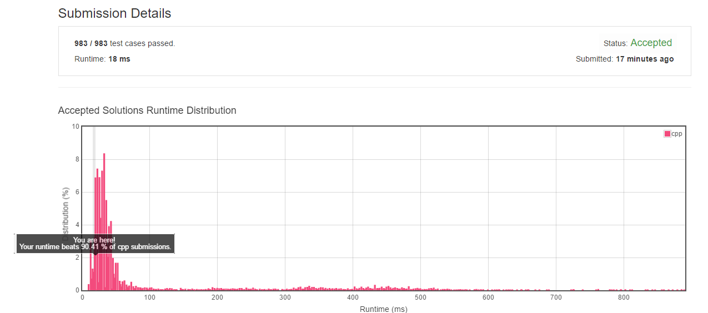

# 003. Longest Substring Without Repeating Characters
------------------------------------------------

## Description
Given a string, find the length of the longest substring without repeating characters.

## Examples
Given `"abcabcbb"`, the answer is `"abc"`, which the length is 3.

Given `"bbbbb"`, the answer is `"b"`, with the length of 1.

Given `"pwwkew"`, the answer is `"wke"`, with the length of 3. Note that the answer must be a substring, "pwke" is a subsequence and not a substring.

## 解题思路
- 给出两个指针`head`和`tail`分别指向`string`的`begin()`，用这指针之间的字符串表示题目需求的子字符串，不断递增`head`指针，如果遇到重复则改变`tail`指针至最近的重复数字。
- 在遇到重复字符时记录`substring`的长度`length`，选择最小的。
- 在每次遇到重复字符时，会做一个判断，剩余可选择的字符数量是否小于`length`，如果是的话就没必要继续往下找了（因为即使剩余character全未重复也不会大于`length`了)。

### Result

code： [Point here](main.cpp)
